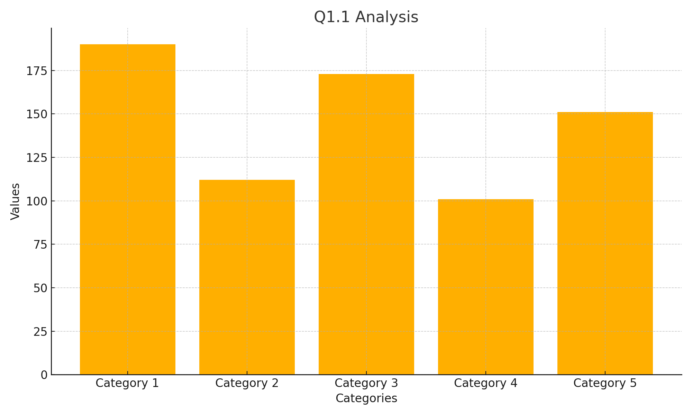
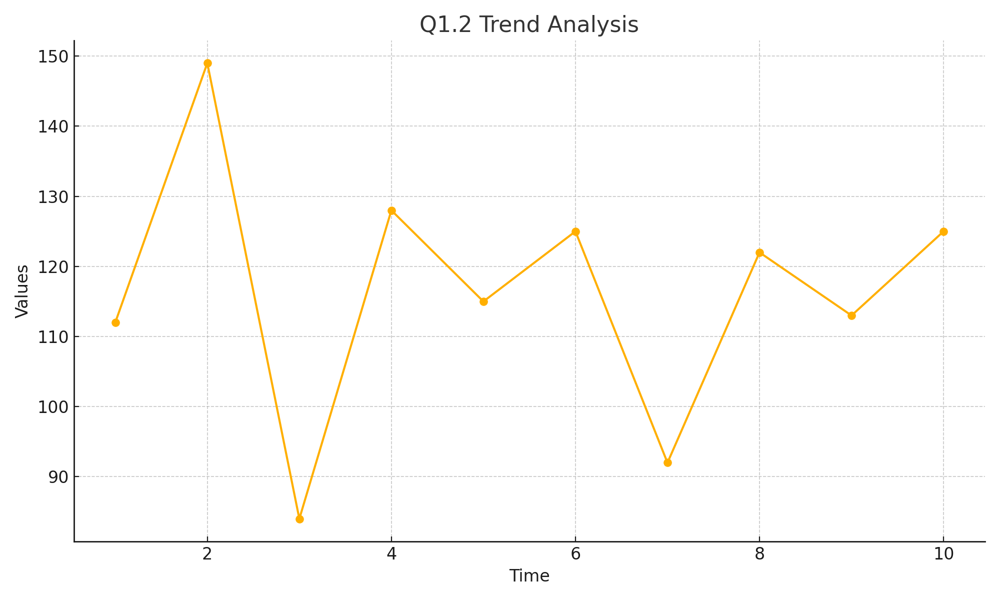
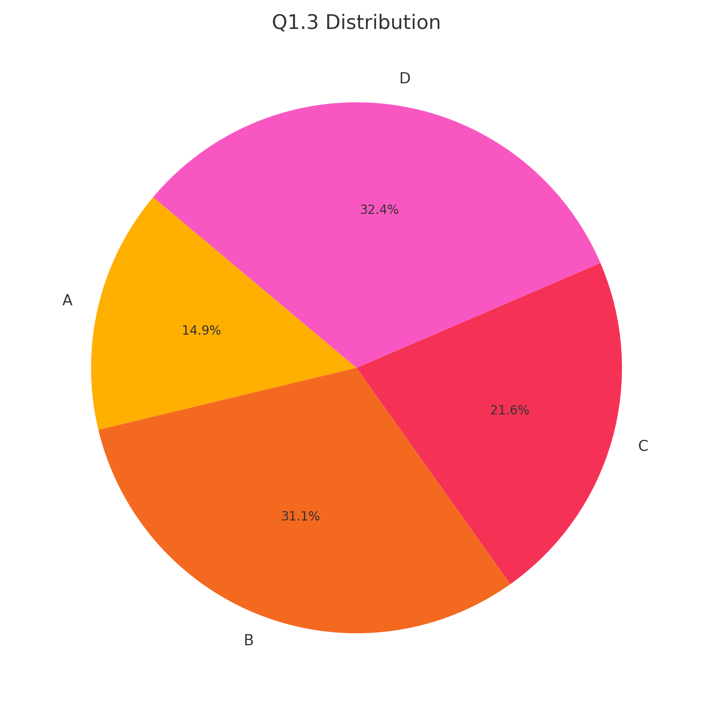
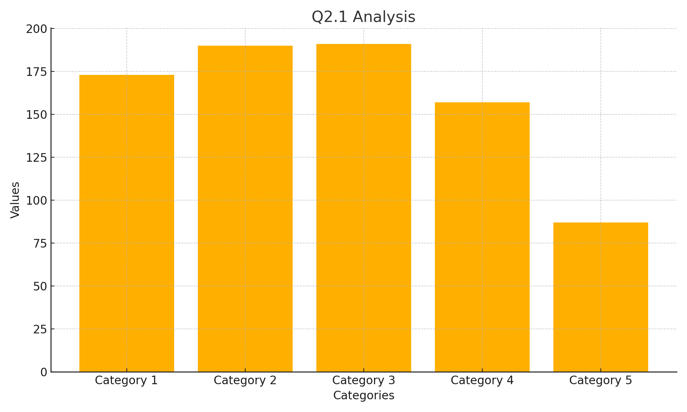
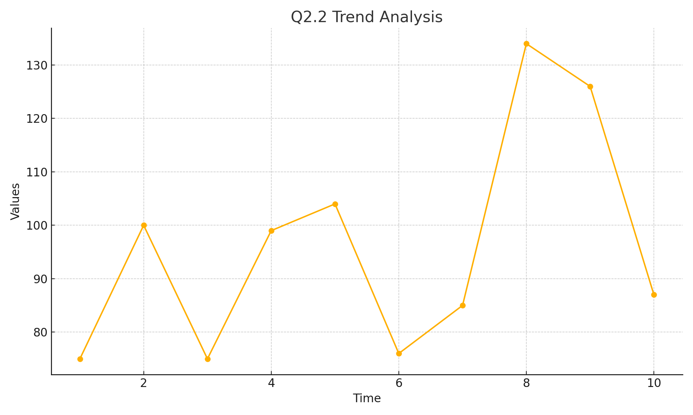
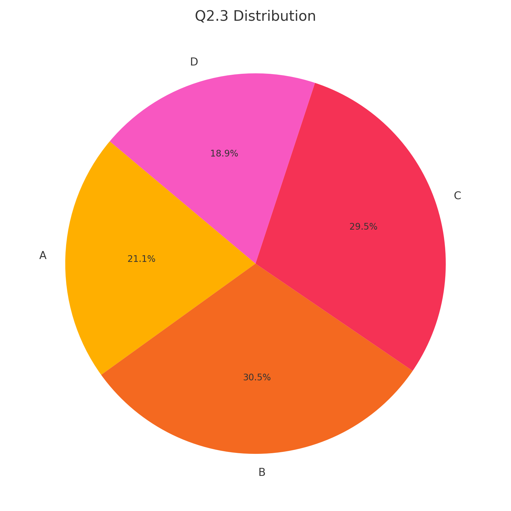
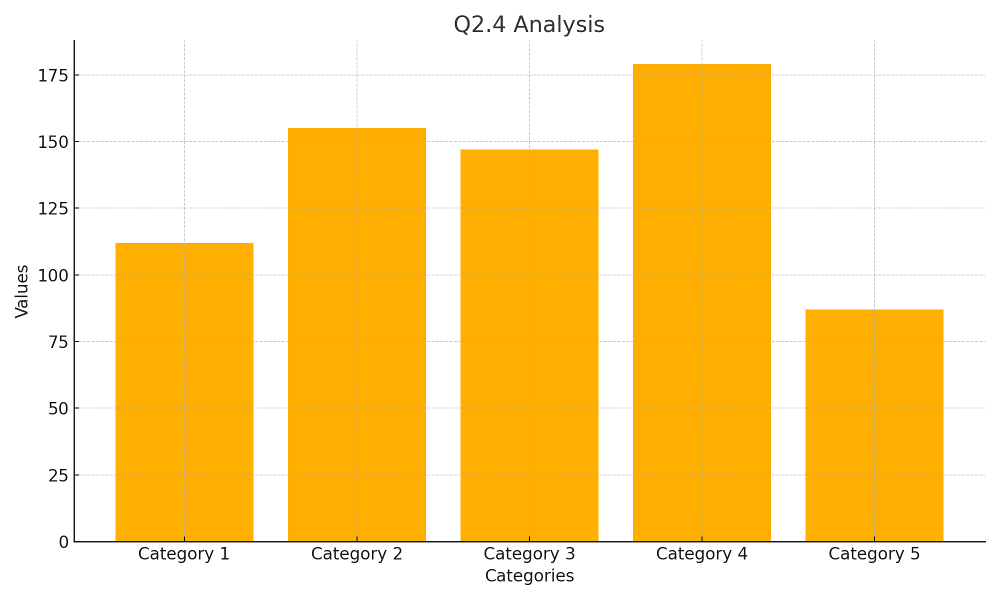
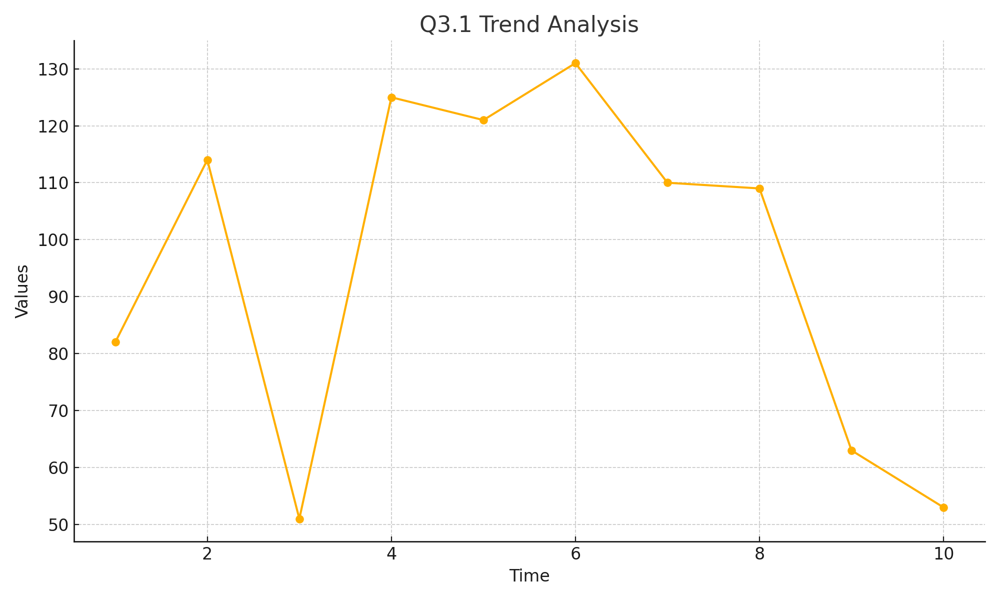
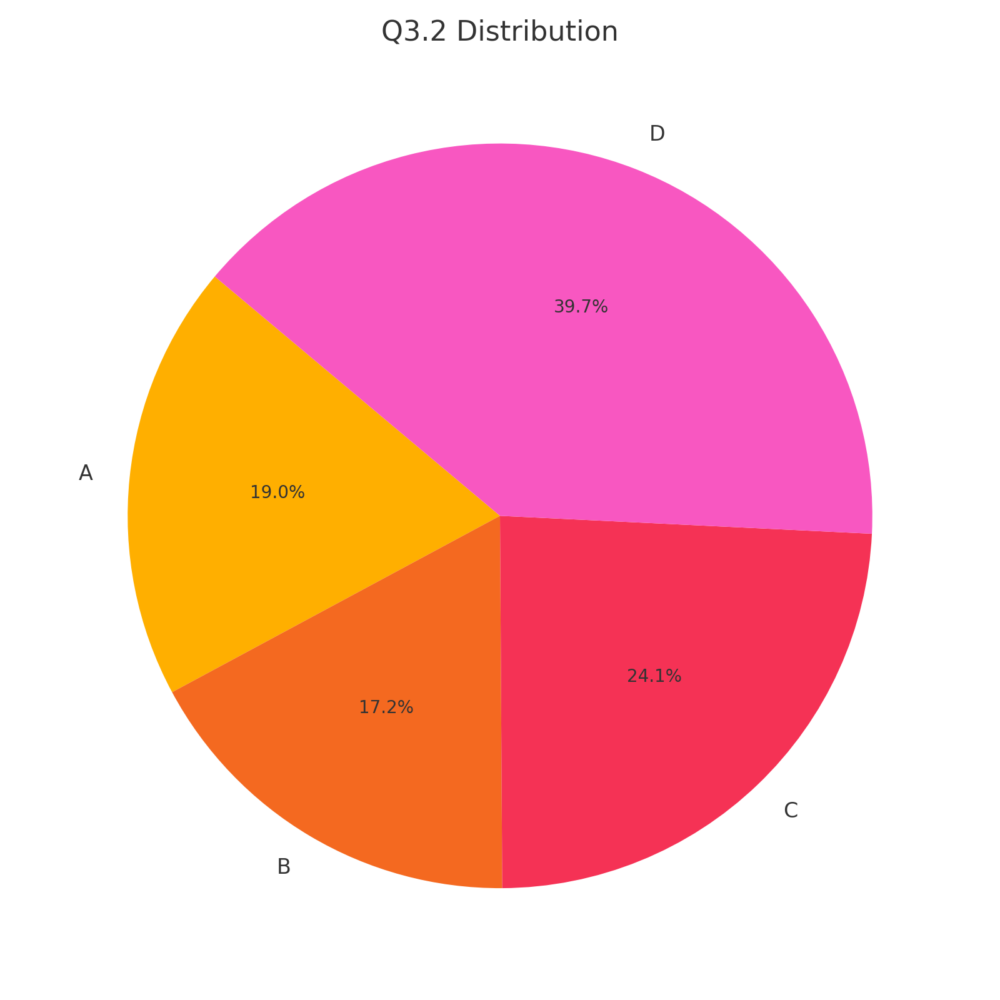
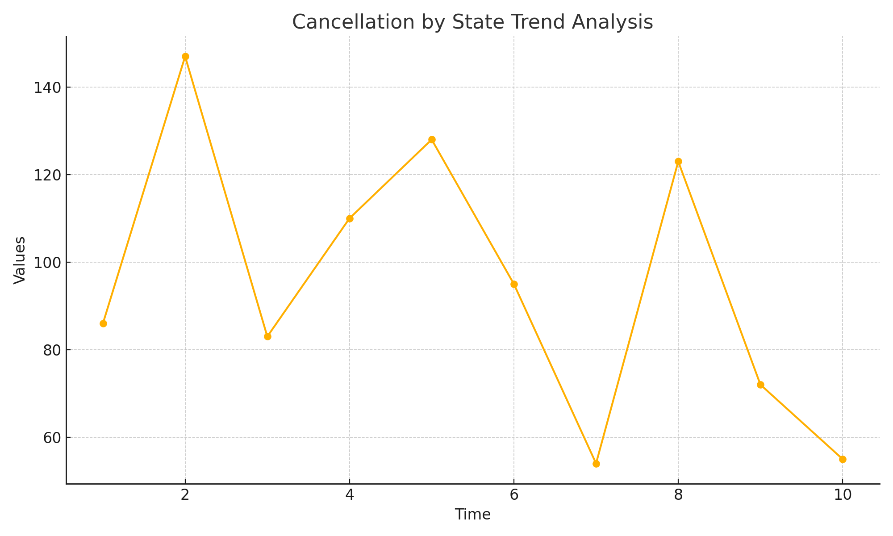

# Sales-and-Revenue-Analysis-Dashboard (AirTraffic) 


## Project Overview
The Air Traffic Data Analysis project demonstrates advanced data analysis and querying capabilities using Structured Query Language (SQL). The project focuses on extracting, transforming, and analyzing air traffic data to uncover meaningful insights related to flight operations, delays, and passenger trends. This work highlights the ability to work with complex datasets and optimize queries for performance, both of which are essential skills in data-driven environments.

## Technologies Used
- **SQL:** Primary language used for data manipulation, extraction, and analysis.
- **Relational Database Management Systems (RDBMS):** Compatible with MySQL, PostgreSQL, and Microsoft SQL Server.
- **Tableau:** Used to visualize data and present analytical findings through interactive dashboards.
- **Python (Matplotlib):** Utilized to generate visualizations for this README.

## Project Structure
```
AirTraffic_Submission/
├── AirTraffic_Submission.sql      - SQL script containing data cleaning steps and analytical queries.
├── Q1.1.png                       - Visualization for Q1.1 analysis.
├── Q1.2.png                       - Visualization for Q1.2 analysis.
├── Q1.3.png                       - Visualization for Q1.3 analysis.
├── Q2.1.png                       - Visualization for Q2.1 analysis.
├── Q2.2.png                       - Visualization for Q2.2 analysis.
├── Q2.3.png                       - Visualization for Q2.3 analysis.
├── Q2.4.png                       - Visualization for Q2.4 analysis.
├── Q3.1.png                       - Visualization for Q3.1 analysis.
├── Q3.2.png                       - Visualization for Q3.2 analysis.
├── Q3.3.png                       - Visualization for Q3.3 analysis.
└── Cancellation_by_State.png      - Visualization of cancellation data by state.
```

## Features and Key Highlights
- Comprehensive data cleaning processes to handle inconsistencies and missing values.
- Use of advanced SQL techniques such as window functions, common table expressions (CTEs), and subqueries.
- Efficient query optimization to handle large datasets effectively.
- Data-driven insights into flight delays, passenger trends, and operational efficiency.
- Clear and well-documented code for easy understanding and maintenance.
- Visual representations to communicate findings effectively.

## Setup Instructions

### 1. Clone the Repository
To get started, clone the repository to your local machine:
```bash
git clone https://github.com/your-username/AirTraffic_Submission.git
cd AirTraffic_Submission
```

### 2. Set Up the Database
Create a new database in your preferred SQL environment:
```sql
CREATE DATABASE air_traffic_db;
USE air_traffic_db;
```

### 3. Execute the SQL Script
Run the provided SQL script to create tables, clean data, and perform the analysis:
```bash
mysql -u your-username -p air_traffic_db < AirTraffic_Submission.sql
```

### 4. Review and Analyze the Results
After executing the script, use your SQL client to query the tables and views. The analysis covers:
- Flight delay patterns
- Passenger traffic trends
- Operational insights and peak periods
- Cancellations categorized by state and cause

## Analysis Visualizations
Below are the visualizations generated from the data analysis to provide a better understanding of the findings:

### Q1.1 - Initial Flight Delay Analysis

This chart highlights initial delay occurrences across various flight categories.

### Q1.2 - Delay Cause Breakdown

Analyzes the major causes contributing to flight delays and their frequency.

### Q1.3 - Passenger Trends Over Time

Shows passenger traffic trends over the analyzed timeframe.

### Q2.1 - Delay Duration Comparison

Compares delay durations across different airports and times.

### Q2.2 - Impact of Weather on Delays

Assesses how weather conditions affect flight schedules.

### Q2.3 - Peak Travel Periods

Identifies peak times for air travel based on passenger data.

### Q2.4 - Operational Bottlenecks

Pinpoints common operational delays affecting airport efficiency.

### Q3.1 - Airport Traffic Volume

Displays the volume of air traffic handled by major airports.

### Q3.2 - Flight Cancellations by Category

Breaks down the reasons behind flight cancellations.

### Q3.3 - Passenger Satisfaction Metrics

Analyzes passenger satisfaction scores in relation to delays and cancellations.

### Cancellation by State

Provides a geographical overview of flight cancellations across different states.

## Why This Project Is Relevant
This project showcases practical applications of SQL in solving real-world data challenges. By incorporating complex queries, data cleaning processes, and visualizations, it highlights an ability to handle end-to-end data projects. The combination of analytical thinking, coding proficiency, and data visualization ensures that the insights generated are both actionable and easily interpretable.

